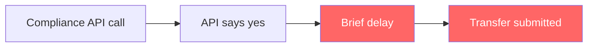
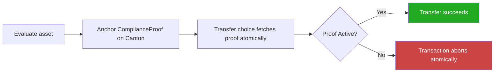
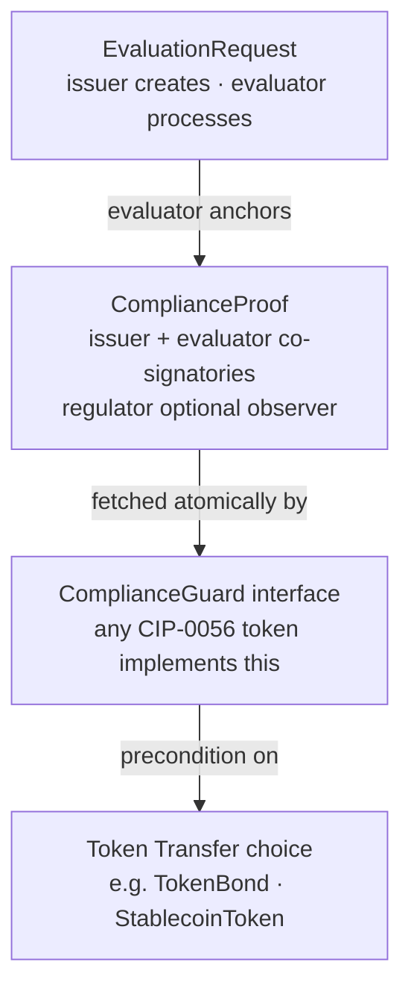
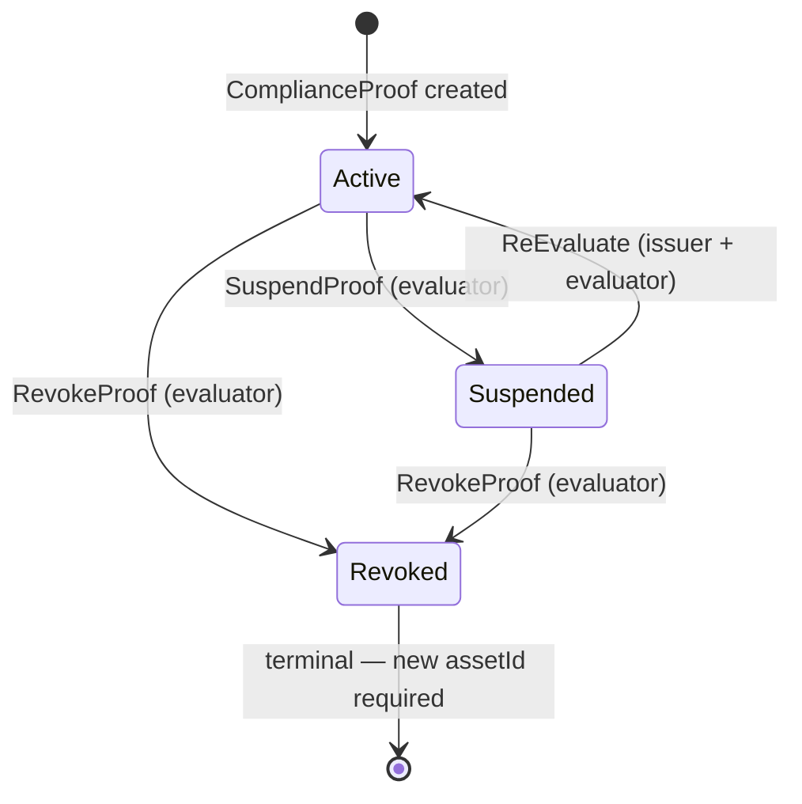

# TokenProof

**TokenProof is a shared compliance infrastructure layer for the Canton Network.**

A privacy-native, on-ledger compliance classification and proof-anchoring primitive for the Canton Global Synchronizer. Any CIP-0056 token implementation can add a `ComplianceGuard` precondition to its `Transfer` choice and gain instant, atomic, privacy-preserving compliance enforcement.

[](https://github.com/Compliledger/canton_tokenproof/actions/workflows/ci.yml)
[](LICENSE)
[](https://docs.canton.network)
[](#)

---

## The problem TokenProof solves

Today, when a tokenized bond moves on Canton, compliance is checked **outside** the blockchain:



The gap between steps 2 and 4 is the problem. If a sanctions list updates or a regulatory status changes in that window, the transfer goes through anyway. Nobody can prove after the fact what compliance state was checked or when.

**TokenProof eliminates that gap:**



Compliance check and transfer are the **same Canton transaction**. Neither can happen without the other. The proof is on-ledger and auditable forever.

---

## What it does

Canton has the protocol infrastructure for atomic, privacy-preserving settlement. It is missing a shared compliance oracle that token implementations can reference atomically. TokenProof fills that gap.

- **`ComplianceProof`** — an on-ledger DAML contract anchoring classification outcomes, proof hashes, and lifecycle state for any tokenized asset
- **`ComplianceGuard`** — a DAML interface; implement it on any CIP-0056 token to add a compliance precondition that fires inside the same transaction as the asset movement
- **Classification Engine** — deterministic Python/FastAPI service evaluating assets against GENIUS Act, CLARITY Act, and SEC classification frameworks
- **Canton Adapter** — uses Canton's JSON Ledger API v2 (port 6864)
- **TypeScript SDK** — `@tokenproof/canton-sdk`; uses `@c7/ledger`, not the deprecated `@daml/ledger`

### Contract architecture



### Proof status lifecycle



---

## Why this cannot be built on any other chain

Canton sub-transaction privacy means the sync domain operator sees only encrypted routing metadata — never transaction content. Compliance proof data is shared only with parties explicitly granted signatory or observer rights. This is structurally impossible on Ethereum or any public chain.

---

## Quick start

```bash
# Build and test DAML contracts
cd daml && dpm build && dpm test

# Start local sandbox
cd daml && dpm sandbox
# JSON Ledger API available at http://localhost:6864

# Start backend (new terminal)
cd backend
cp .env.example .env   # fill in party fingerprints
pip install -r requirements.txt
uvicorn api:app --reload

# Build SDK
cd sdk && npm install && npm run build
```

Full setup in [docs/quickstart.md](docs/quickstart.md).

---

## Repository layout

```
daml/           DAML contract layer — primary deliverable
examples/       CIP-0056 gated transfer + stablecoin GENIUS Act examples
backend/        Classification engine + Canton Ledger API adapter
sdk/            @tokenproof/canton-sdk TypeScript package (M4)
docs/           Architecture reference + quickstart guide
```

---

## Policy packs

| Pack | Regulatory framework | Output |
|------|---------------------|--------|
| `GENIUS_v1` | GENIUS Act — stablecoin classification | `payment_stablecoin` |
| `CLARITY_v1` | CLARITY Act — market structure | `digital_commodity` |
| `SEC_CLASSIFICATION_v1` | SEC digital securities analysis | `digital_security` |

Worst-of aggregation: one failing control → `mixed_or_unclassified`. All controls are deterministic rules — not legal opinions.

---

## Canton Dev Fund

TokenProof is being developed with support from the Canton Dev Fund. Proposal: [docs/architecture.md](docs/architecture.md).

- **M1** — DAML package design + dpm test passing ✅
- **M2** — Canton Ledger API backend ✅
- **M3** — ComplianceGuard interface + CIP-0056 reference implementation ✅
- **M4** — TypeScript SDK + React dashboard _(in progress)_
- **M5** — Security hardening + MainNet deployment _(planned)_

---

## Contributing

See [CONTRIBUTING.md](CONTRIBUTING.md).

---

## License

Apache 2.0 — all DAML packages, backend, SDK, and dashboard.

---

> **DISCLAIMER:** TokenProof runs deterministic classification controls. This is not legal advice. ComplianceGuard enforces controls; it does not encode laws.
