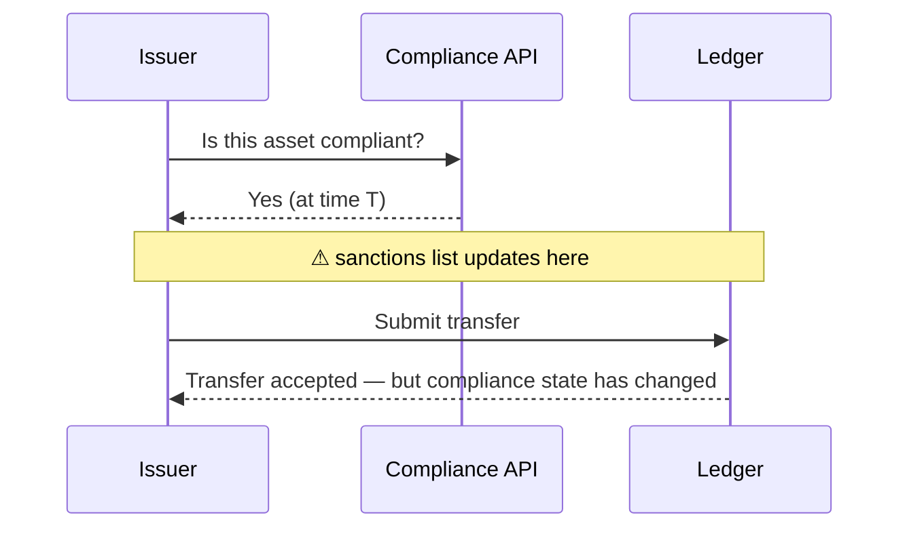
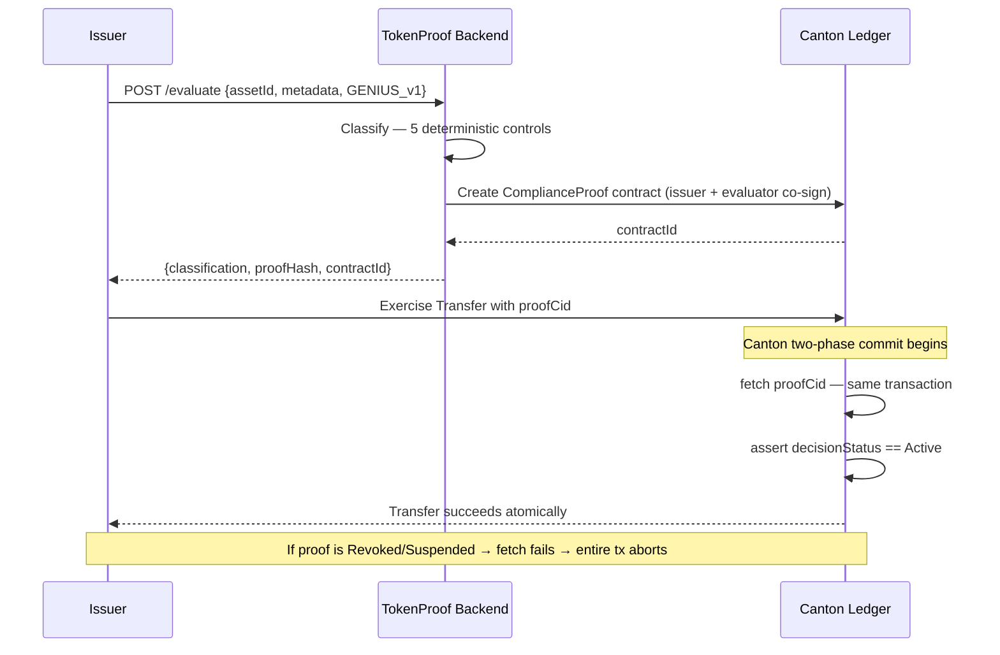
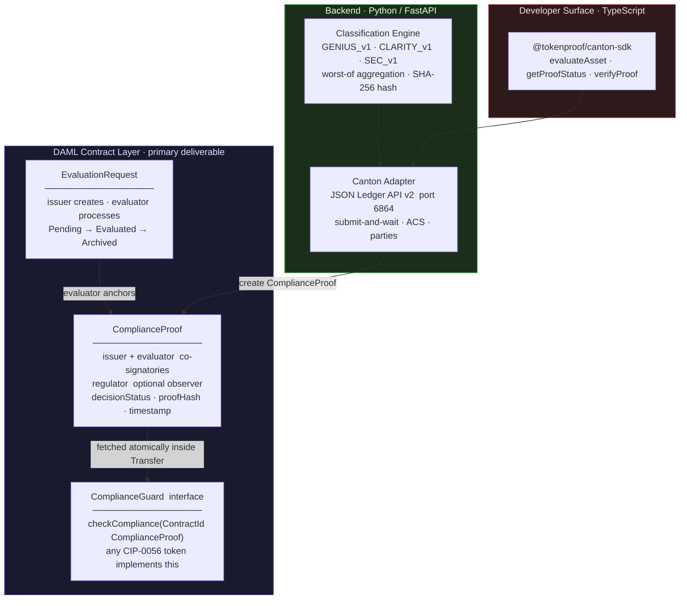
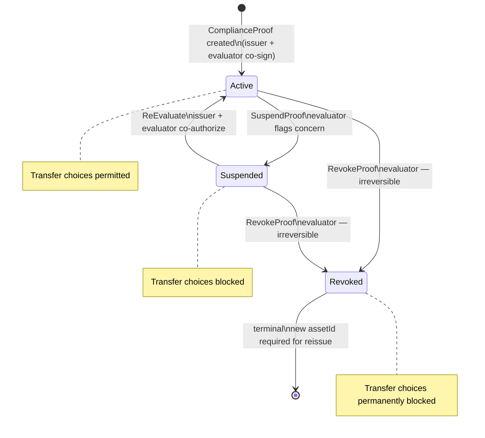

# TokenProof

**Atomic, on-ledger compliance enforcement for tokenized assets on the Canton Network.**

[](https://github.com/Compliledger/canton_tokenproof/actions/workflows/ci.yml)
[](LICENSE)
[](https://docs.canton.network)
[](#)

---

## The problem

Every existing compliance integration on distributed ledgers has the same structural flaw:



**The check and the transfer are two separate operations.** There is a window between them where regulatory state can change — and nobody can prove after the fact what was checked or when.

---

## The solution

TokenProof makes compliance state an **on-ledger property of the transaction itself**:



The compliance check is inside the **same Canton transaction** as the asset movement. No race condition is possible. The proof hash is anchored on-ledger and independently verifiable forever.

---

## Architecture



### Proof lifecycle



---

## Parties

Canton sub-transaction privacy means each party sees only what they are explicitly a stakeholder of.

| Party | Role | Sees on ledger | Can exercise |
|---|---|---|---|
| **Issuer** | Asset originator | Their ComplianceProof, EvaluationRequest, own tokens | ReEvaluate (co-sign), Transfer |
| **Evaluator** | TokenProof service | Every ComplianceProof they co-signed | SuspendProof, RevokeProof, MarkEvaluated |
| **Regulator** | Optional observer | ComplianceProof where `regulator = Some regulatorParty` | Nothing — read-only |
| **Sync Domain** | Canton infrastructure | Encrypted routing metadata only | N/A |
| **Other** | Any other participant | Nothing | Nothing |

This visibility model is enforced at the Canton protocol layer — not application code.

---

## Policy packs

| Pack | Regulatory framework | Controls | Output |
|---|---|---|---|
| `GENIUS_v1` | GENIUS Act (stablecoin) | Issuer type · reserve ratio · certification · redemption · prohibited activities | `payment_stablecoin` |
| `CLARITY_v1` | CLARITY Act (market structure) | Network maturity · controller dependency · disclosure · commodity test | `digital_commodity` |
| `SEC_CLASSIFICATION_v1` | SEC Howey Test analysis | Investment contract · promoter dependency · profit expectation · decentralisation · disclosure | `digital_security` |

One failing control → `mixed_or_unclassified`. All controls are deterministic rules — not legal opinions.

---

## API reference

Backend runs at `http://localhost:8000`. Interactive docs at `/docs`.

| Method | Endpoint | Description |
|---|---|---|
| `GET` | `/health` | Liveness check |
| `POST` | `/evaluate` | Classify asset + anchor ComplianceProof on Canton |
| `POST` | `/evaluate/multi` | Classify against all three policy packs |
| `GET` | `/proof/{assetId}?issuer_party=` | Query live proof status from Canton ACS |
| `POST` | `/verify` | Recompute proof hash and compare against on-ledger record |
| `POST` | `/parties/allocate` | Allocate a new Canton party |

---

## Quick start

```bash
# 1. Build and test DAML contracts
cd daml
dpm build && dpm test

# 2. Start local sandbox (new terminal)
dpm sandbox
# → JSON Ledger API: http://localhost:6864

# 3. Configure and start backend (new terminal)
cd backend
cp .env.example .env        # fill in CANTON_EVALUATOR_PARTY
pip install -r requirements.txt
uvicorn api:app --reload    # → http://localhost:8000/docs

# 4. Evaluate an asset
curl -s -X POST http://localhost:8000/evaluate \
  -H "Content-Type: application/json" \
  -d '{
    "assetId": "STABLECOIN-DEMO-001",
    "issuerParty": "Issuer::1220...",
    "policyPack": "GENIUS_v1",
    "assetMetadata": {
      "issuerType": "insured_depository_institution",
      "reserveRatio": 1.05,
      "monthlyReserveCertification": true,
      "redemptionSupport": true,
      "prohibitedActivities": []
    }
  }'

# 5. Verify proof hash
curl -s -X POST http://localhost:8000/verify \
  -H "Content-Type: application/json" \
  -d '{"assetId":"STABLECOIN-DEMO-001","issuerParty":"Issuer::1220...","proofHash":"sha256:...","policyPack":"GENIUS_v1","assetMetadata":{...}}'
```

Full setup: [docs/quickstart.md](docs/quickstart.md)

---

## Repository layout

```
canton_tokenproof/
├── daml/                        ← PRIMARY DELIVERABLE — dpm build + dpm test
│   ├── Main/
│   │   ├── ComplianceProof.daml ← core on-ledger compliance record
│   │   ├── ComplianceGuard.daml ← interface any CIP-0056 token implements
│   │   ├── EvaluationRequest.daml
│   │   └── Types.daml
│   └── Test/
│       ├── ComplianceProofTest.daml
│       └── TransferGateTest.daml
├── examples/
│   ├── cip0056-gated-transfer/  ← TokenBond + atomic DvP demo
│   └── stablecoin-genius-act/   ← StablecoinToken with GENIUS Act minting gate
├── backend/
│   ├── api.py                   ← FastAPI endpoints
│   ├── engine.py                ← classification engine + proof hash
│   ├── canton_adapter.py        ← Canton JSON Ledger API v2 adapter
│   ├── policy_packs/            ← GENIUS_v1 · CLARITY_v1 · SEC_v1
│   └── tests/
├── sdk/                         ← @tokenproof/canton-sdk  (M4)
└── docs/
    ├── architecture.md
    └── quickstart.md
```

---

## Milestones

| Milestone | Deliverable | Status |
|---|---|---|
| M1 | DAML package — `dpm test` passing | ✅ Complete |
| M2 | Canton Ledger API v2 backend | ✅ Complete |
| M3 | ComplianceGuard interface + CIP-0056 examples | ✅ Complete |
| M4 | TypeScript SDK + React dashboard | In progress |
| M5 | Security hardening + MainNet deployment | Planned |

Proposal: [docs/architecture.md](docs/architecture.md) · Canton Dev Fund

---

## Contributing

See [CONTRIBUTING.md](CONTRIBUTING.md).

---

## License

Apache 2.0 — DAML packages, backend, SDK, and dashboard.

> **DISCLAIMER:** TokenProof runs deterministic classification controls. This is not legal advice. ComplianceGuard enforces controls; it does not encode laws.
