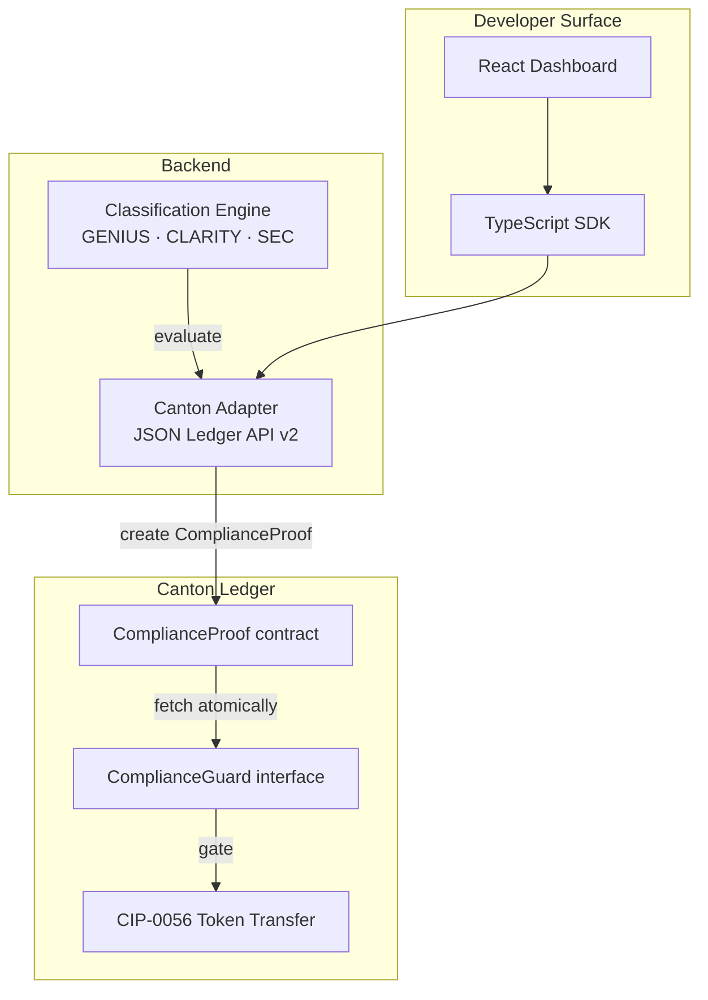
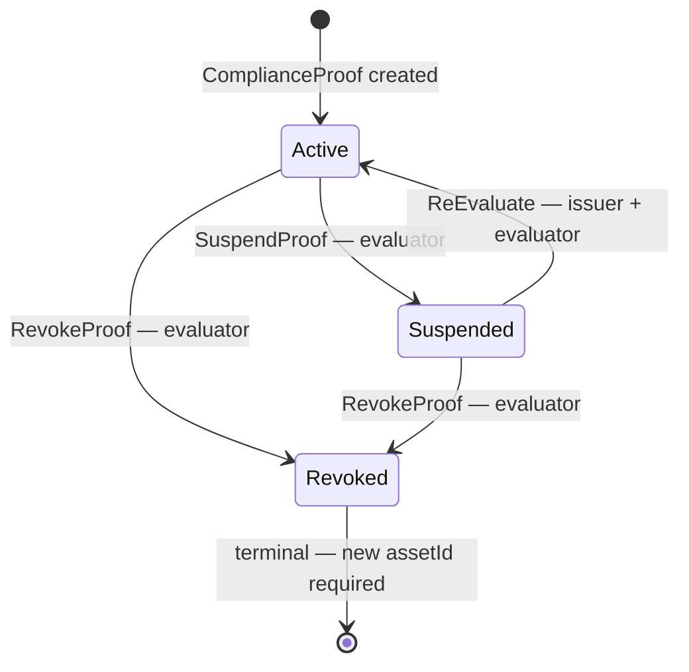
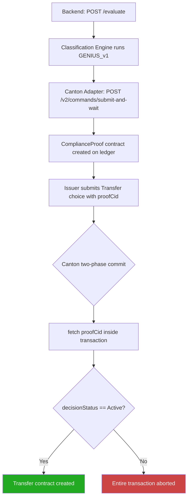
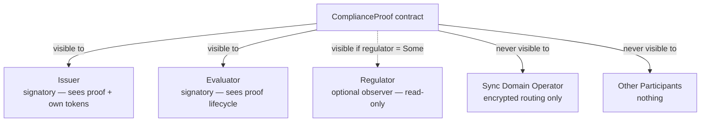
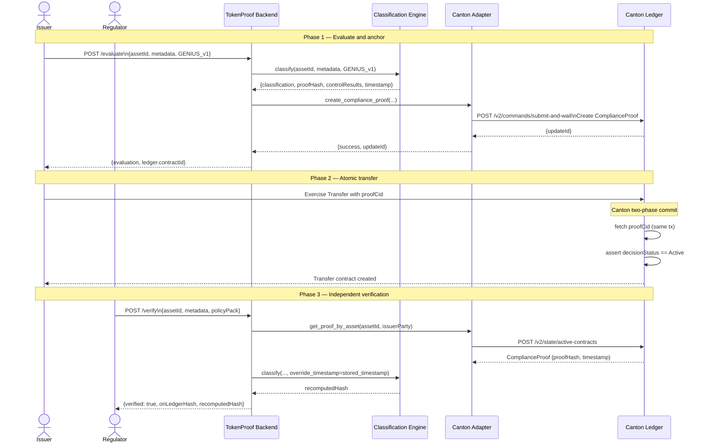

# TokenProof — Architecture Reference

## Four-Layer Design

TokenProof is composed of four layers. Each layer is independently replaceable and open-sourced under Apache 2.0.

| Layer | Technology | Purpose |
|-------|-----------|----------|
| DAML Contract Layer | DAML SDK 3.4.11 · dpm build | On-ledger proof contracts, party-scoped privacy |
| Classification Engine | Python 3.11 · FastAPI | Deterministic policy evaluation, 3 packs |
| Canton Ledger API Adapter | JSON Ledger API v2 (port 6864 bare sandbox / 7575 LocalNet) | Command submission, ACS queries, party allocation |
| Developer Surface | TypeScript · React | SDK, dashboard, CIP-0103 integration |



---

## DAML Contract Architecture

### Templates

**`Main.ComplianceProof`**
The core on-ledger compliance record. Immutable after creation except through explicit lifecycle choices.

- `signatory`: `issuer` (asset issuer) + `evaluator` (TokenProof evaluator)
- `observer`: `regulator` (Optional Party — scoped read-only)
- **No global contract key** — Canton 3.4 / Daml-LF 2.x removed global keys. Callers hold `ContractId ComplianceProof` explicitly and pass it to `Transfer`/`Mint` choices. `fetch` on an archived contract fails atomically — Revoked/Suspended proofs block the transaction inherently.
- `choices`: `SuspendProof` · `RevokeProof` · `ReEvaluate`

**`Main.EvaluationRequest`**
Request lifecycle tracking. Issuer creates; evaluator processes and closes.

- `signatory`: `issuer`
- `observer`: `evaluator`
- `choices`: `MarkEvaluated` · `ArchiveRequest`

### Interface

**`Main.ComplianceGuard`**
A DAML interface any CIP-0056 token can implement to add an atomic compliance precondition on its Transfer choice.

```daml
interface ComplianceGuard where
  viewtype ComplianceGuardView
  checkCompliance : ContractId ComplianceProof -> Update ()
```

The `checkCompliance` method `fetch`es the `ComplianceProof` by `ContractId` inside the same Canton transaction as the asset movement. If the proof is `Suspended` or `Revoked` its contract is archived — `fetch` on an archived contract aborts the entire transaction atomically. Atomicity is guaranteed by Canton's two-phase commit.

### DecisionStatus Lifecycle



- **Active**: transfers permitted
- **Suspended**: transfers blocked, investigation in progress
- **Revoked**: transfers blocked permanently; issuer must redeploy with new `assetId`

---

## JSON Ledger API Endpoints Used

Sandbox runs on `http://localhost:6864` (HTTP JSON API v2) with bare `dpm sandbox`, or
`http://localhost:7575` with CN Quickstart LocalNet. Set `CANTON_LEDGER_API_URL` accordingly.
gRPC Ledger API: `localhost:6865` (bare sandbox) / `localhost:6866` (LocalNet).

| Operation | Endpoint |
|-----------|----------|
| Create ComplianceProof | `POST /v2/commands/submit-and-wait` |
| Query proof by asset | `POST /v2/state/active-contracts` |
| Allocate party | `POST /v2/parties` |
| Get ledger end offset | `GET /v2/ledger-end` |
| Stream proof events | gRPC Ledger API port 6865 |

**Not used**: deprecated `daml ledger upload-dar`, `daml ledger allocate-parties`, `@daml/ledger`.

### Atomic DvP flow



---

## Canton Privacy Model

Canton sub-transaction privacy means each participant sees only the contracts where they are a signatory or observer.



| Party | Sees |
|-------|------|
| Issuer | Their own ComplianceProof, EvaluationRequest, token holdings |
| Evaluator | ComplianceProof they co-signed, proof lifecycle events |
| Regulator | ComplianceProof records where `regulator = Some regulatorParty` |
| Sync Domain | Encrypted routing metadata only — never payload contents |
| Other participants | Nothing — Canton sub-transaction privacy |

This model is structurally impossible on any public chain (Ethereum, Algorand).

---

## Classification Engine

### Policy Packs

| Pack | Controls | Output Classification |
|------|----------|----------------------|
| `GENIUS_v1` | issuer type · reserve ratio · certification · redemption · prohibited activities | `payment_stablecoin` |
| `CLARITY_v1` | network maturity · controller dependency · disclosure · commodity test | `digital_commodity` |
| `SEC_CLASSIFICATION_v1` | investment contract · promoter dependency · profit expectation · decentralisation · disclosure | `digital_security` |

### Worst-of Aggregation

One failing control → `mixed_or_unclassified`. No partial passes. Mirrors prudential regulatory logic.

### Proof Hash

`SHA-256(assetId + classification + policyVersion + controlResults + timestamp)`

Anchored in `ComplianceProof.proofHash`. Regulator can recompute independently via `POST /verify`.

---

## End-to-End Sequence

Full flow from initial evaluation through atomic settlement and independent verification.



---

## Why Canton — Structural Comparison

| Capability | Canton + TokenProof | Ethereum / EVM | Algorand |
|---|---|---|---|
| Compliance check in same transaction as transfer | **Yes** — Canton two-phase commit | No — oracle call is a separate transaction | No — separate transaction |
| Privacy for compliance data | **Sub-transaction privacy** — parties see only their contracts | None — all state is public | None — all state is public |
| Proof hash independently auditable | **Yes** — `POST /verify` recomputes SHA-256 | Possible with events, but state is public | Possible, but state is public |
| Compliance state race condition | **Impossible** — `fetch` on archived contract aborts atomically | Possible — block reorg or MEV can reorder | Possible — FIFO not guaranteed |
| Regulator scoped read access | **Native** — `Optional Party` observer | Impossible without centralized access control | Impossible without centralized access control |
| Sync domain sees compliance data | **Never** — encrypted routing only | Yes — validators see all | Yes — relay nodes see all |
| Smart contract can call compliance oracle | No — but not needed; proof is already on-ledger | Requires trusted oracle (Chainlink etc.) | Requires trusted oracle |

---

## Repository Structure

```
canton_tokenproof/
├── daml/                          # PRIMARY DELIVERABLE — dpm build + dpm test
│   ├── daml.yaml
│   ├── Main/
│   │   ├── ComplianceProof.daml
│   │   ├── ComplianceGuard.daml
│   │   ├── Types.daml
│   │   └── EvaluationRequest.daml
│   └── Test/
│       ├── ComplianceProofTest.daml
│       └── TransferGateTest.daml
├── examples/
│   ├── cip0056-gated-transfer/
│   │   ├── TokenBond.daml
│   │   └── DvPWorkflow.daml
│   └── stablecoin-genius-act/
│       └── StablecoinToken.daml
├── backend/
│   ├── api.py
│   ├── engine.py
│   ├── canton_adapter.py
│   ├── requirements.txt
│   └── policy_packs/
│       ├── GENIUS_v1.py
│       ├── CLARITY_v1.py
│       └── SEC_v1.py
├── sdk/
│   ├── package.json
│   ├── tsconfig.json
│   └── src/index.ts
├── docs/
│   ├── architecture.md
│   └── quickstart.md
└── .github/workflows/ci.yml
```
