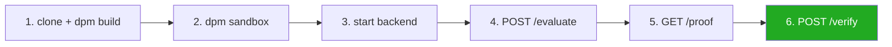

# TokenProof — Quickstart



## Prerequisites

- Canton SDK 3.4.11 with DPM installed
- Python 3.11+
- Node 20+
- A Canton participant node (local sandbox or DevNet)

---

## 1. Build and test the DAML contracts

```bash
cd daml
dpm build
dpm test
```

Both commands must exit 0 before proceeding. The test suite covers the full proof lifecycle and the atomic transfer gate enforcement.

---

## 2. Run a local sandbox

```bash
cd daml
dpm sandbox
```

The local Canton sandbox starts with JSON Ledger API on **port 6864** (HTTP) and gRPC on port 6865.

---

## 3. Start the backend

```bash
cd backend
pip install -r requirements.txt

# Copy the example env file and fill in your party fingerprints
cp .env.example .env

# Or export directly:
export CANTON_LEDGER_API_URL=http://localhost:6864
export CANTON_EVALUATOR_JWT=
export CANTON_EVALUATOR_PARTY=<TokenProofEvaluator::fingerprint>
export TOKENPROOF_PACKAGE_ID=<package-id-from-dpm-build-output>

uvicorn api:app --reload --port 8000
```

API is available at `http://localhost:8000`. Interactive docs at `http://localhost:8000/docs`.

---

## 4. Evaluate an asset and anchor a proof

```bash
curl -X POST http://localhost:8000/evaluate \
  -H "Content-Type: application/json" \
  -d '{
    "assetId": "STABLECOIN-DEMO-001",
    "issuerParty": "Issuer::fingerprint",
    "policyPack": "GENIUS_v1",
    "assetMetadata": {
      "issuerType": "federal_qualified_nonbank",
      "reserveRatio": 1.02,
      "monthlyReserveCertification": true,
      "redemptionSupport": true,
      "prohibitedActivities": []
    },
    "anchorOnLedger": true
  }'
```

---

## 5. Query proof status

```bash
curl "http://localhost:8000/proof/STABLECOIN-DEMO-001?issuer_party=Issuer::fingerprint"
```

---

## 6. Use the TypeScript SDK

```bash
cd sdk
npm install
npm run build
```

```typescript
import { createTokenProofClient } from "@tokenproof/canton-sdk";

const client = createTokenProofClient("http://localhost:8000");

const result = await client.evaluateAsset({
  assetId: "STABLECOIN-DEMO-001",
  issuerParty: "Issuer::fingerprint",
  policyPack: "GENIUS_v1",
  assetMetadata: {
    issuerType: "federal_qualified_nonbank",
    reserveRatio: 1.02,
    monthlyReserveCertification: true,
    redemptionSupport: true,
    prohibitedActivities: [],
  },
});

console.log(result.evaluation.classification);
// => "payment_stablecoin"

const proof = await client.getProofStatus("STABLECOIN-DEMO-001", "Issuer::fingerprint");
console.log(proof.decisionStatus);
// => "Active"
```

---

## 7. Run the DvP example

```bash
cd examples/cip0056-gated-transfer
dpm test
```

This runs two scripts: `atomicDvPDemo` and `dvpWorkflowDemo`. Both must exit with `ok`. The DvP demo exercises: proof anchored → transfer succeeds → proof revoked → transfer fails (`submitMustFail`).

---

## Deployment Path

| Stage | Command | Notes |
|-------|---------|-------|
| Local | `dpm sandbox` | Port 6864, resets on restart |
| DevNet | `dpm deploy --network devnet` | Shared Canton DevNet |
| TestNet | `dpm deploy --network testnet` | Stable, xReserve bridge available |
| MainNet | Kubernetes validator or NaaS | Canton Global Synchronizer |

---

## DISCLAIMER

TokenProof runs deterministic classification controls derived from the GENIUS Act, CLARITY Act, and SEC analysis frameworks. This is not legal advice. ComplianceGuard enforces controls; it does not encode laws. Consult qualified legal counsel before relying on any classification outcome for regulatory compliance decisions.
